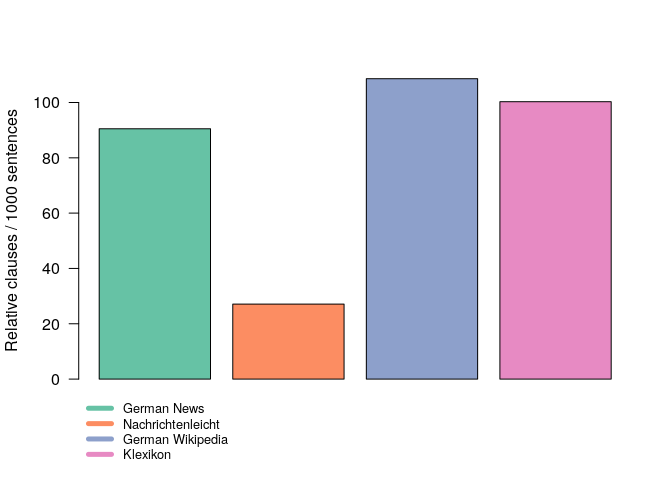

Korpus Einfaches Deutsch (KED)
================

What is KED?
------------

KED is a large digital collection of texts in simple German from genres of educational and public discourse. For example, KED contains lexicon entries, instructions, and informative and explanatory texts on different academic, political, economic, cultural, and legal topics. The texts are written for readers who have not (yet) developed reading skills good enough to understand these genres in academic language ("Bildungssprache", Gogolin and Duarte 2016), such as children and readers with cognitive impairments. KED is aimed at foreign language learners, teachers, and linguistic researchers as a resource for data-driven foreign language learning at lower levels of proficiency and for corpus-based research into linguistic complexity.

What is KED made of?
--------------------

The KED texts were scraped from different online websites using *Sketch Engine* (Kilgarriff et al. 2014, <https://www.sketchengine.eu/>).

<table class="table table-responsive" style="margin-left: auto; margin-right: auto;">
<thead>
<tr>
<th style="text-align:left;">
</th>
<th style="text-align:right;">
Texts
</th>
<th style="text-align:right;">
Words
</th>
<th style="text-align:left;">
Source
</th>
<th style="text-align:left;">
Copyright
</th>
</tr>
</thead>
<tbody>
<tr>
<td style="text-align:left;">
Geolino
</td>
<td style="text-align:right;">
1947
</td>
<td style="text-align:right;">
768566
</td>
<td style="text-align:left;">
Texts from the Geolino website, the children's version of the German educational monthly magazine *Geo*. The website contains educational texts, handicraft and game instructions, recipes, and encyclopedic entries, <https://www.geo.de/geolino>
</td>
<td style="text-align:left;">
Written permission obtained
</td>
</tr>
<tr>
<td style="text-align:left;">
Klexikon
</td>
<td style="text-align:right;">
1983
</td>
<td style="text-align:right;">
834119
</td>
<td style="text-align:left;">
Texts from an online encyclopedia for children similar to *Wikipedia*, <https://klexikon.zum.de>
</td>
<td style="text-align:left;">
[CC BY-NC 3.0 DE](https://creativecommons.org/licenses/by-nc/3.0/de/deed.en)
</td>
</tr>
<tr>
<td style="text-align:left;">
Labbe
</td>
<td style="text-align:right;">
1625
</td>
<td style="text-align:right;">
328719
</td>
<td style="text-align:left;">
Narratives, fairy tales, handicraft and game instructions, and so on for children by LABBÉ GmbH, <http://www.labbe.de/lesekorb>
</td>
<td style="text-align:left;">
Written permission obtained
</td>
</tr>
<tr>
<td style="text-align:left;">
Nachrichtenleicht
</td>
<td style="text-align:right;">
1744
</td>
<td style="text-align:right;">
366326
</td>
<td style="text-align:left;">
Texts from a news website in plain language by German public service radio *Deutschlandfunk*, <https://www.nachrichtenleicht.de>
</td>
<td style="text-align:left;">
Written permission obtained
</td>
</tr>
<tr>
<td style="text-align:left;">
Oekoleo
</td>
<td style="text-align:right;">
301
</td>
<td style="text-align:right;">
166979
</td>
<td style="text-align:left;">
Texts from a website for children about environment protection provided by the Hessisches Ministerium für Umwelt, Klimaschutz, Landwirtschaft und Verbraucherschutz, <https://www.oekoleo.de>
</td>
<td style="text-align:left;">
[CC BY-NC 3.0 DE](https://creativecommons.org/licenses/by-nc/3.0/de/deed.en)
</td>
</tr>
<tr>
<td style="text-align:left;">
Rechte-einfach
</td>
<td style="text-align:right;">
20
</td>
<td style="text-align:right;">
20051
</td>
<td style="text-align:left;">
Texts in plain language from different sources about legal topics, <https://www.ich-kenne-meine-rechte.de>, [UN Behinderrechtskonvention in Leichter Sprache by Bundesministerium für Arbeit und Soziales](https://www.bmas.de/DE/Service/Medien/Publikationen/a729L-un-konvention-leichte-sprache.html), [Kinder-Rechte in Leichter Sprache by AWO-Bundesverband e.V.](https://www.awo.org/sites/default/files/2019-07/AWO_UN_Kinderrechte_Leichte%20Sprache_Ansicht.pdf)
</td>
<td style="text-align:left;">
Written permission obtained
</td>
</tr>
<tr>
<td style="text-align:left;">
Rossipotti
</td>
<td style="text-align:right;">
572
</td>
<td style="text-align:right;">
930973
</td>
<td style="text-align:left;">
Texts from an online literary magazin for children including an encyclopaedia of literature, informative texts about genres, authors, history of literature, book reviews, and so on, <https://www.rossipotti.de>
</td>
<td style="text-align:left;">
Written permission obtained
</td>
</tr>
<tr>
<td style="text-align:left;">
Total
</td>
<td style="text-align:right;">
8192
</td>
<td style="text-align:right;">
3415733
</td>
<td style="text-align:left;">
</td>
<td style="text-align:left;">
</td>
</tr>
</tbody>
</table>
A large part of KED consists of texts in plain language ("leichte Sprache", "einfache Sprache", Kellermann 2014). In general plain language attempts to make difficult texts more understandable to readers with low reading skills without corrupting the content (Stefanowitsch 2014).

<table>
<colgroup>
<col width="50%" />
<col width="50%" />
</colgroup>
<thead>
<tr class="header">
<th>Plain language (&quot;leichte Sprache&quot;)</th>
<th>Plain language (&quot;einfache Sprache&quot;)</th>
</tr>
</thead>
<tbody>
<tr class="odd">
<td>Plain language (&quot;leichte Sprache&quot;) follows certain linguistic and ortho-/typographic principles (Netzwerk Leichte Sprache 2017) to make difficult texts on legal topics more accessible to readers with cognitive and perceptual impairments. The texts in the KED subcorpus <em>Rechte-einfach</em> are good examples of plain language in this sense.</td>
<td>Plain language (&quot;einfache Sprache&quot;) does not follow specific principles and addresses a larger audience without cognitive impairments but with difficulties reading texts (12.1% of the adult German population in the year 2018, according to Grotlüschen et al. 2019, 5). The texts in the KED subcorpus <em>Nachrichtenleicht</em> are a good example of plain language in this sense.</td>
</tr>
</tbody>
</table>

Another large part of KED consists of texts written for children with educational purpose. Good examples are the texts in the subcorpus *Oekoleo*. The texts cover different topics on environment protection and nature in general.

KED does not contain texts that are specifically written for foreign language learners such as learning material by the *Goethe Institut* or *Deutsche Welle*. Even though KED is intended as a resource for foreign language learning, German-as-a-foreign-language texts were not included. These texts are often not written in simple language and, in addition, do not reflect actual native language use (Tschirner 2019).

What is KED made for?
---------------------

### Data-driven foreign language learning at low proficiency levels

Corpus-linguistic research indicates that much of adult native language use is not based on grammatical rules but follows repetitive patterns and consists to a considerable extent of prefabricated chunks (Sinclair 1991; Wray and Perkins 2000). Both native and nonnative learners acquire the patterns and chunks of their target language through practice from language use (Ellis, Römer, and O’Donnell 2016; Tomasello 2003).

In line with this, data-driven language learning (DDL) exposes learners to large amounts of input to enable usage-based language acquisition. However, while much of usage-based language acquisition in real life occurs incidentally and unconsciously, in the classroom learners are aware of what they are doing. In DDL learners act as linguistic researchers and use corpus technology (so-called concordancers) to discover the usage patterns and chunks of the target language by themselves (T. Cobb and Boulton 2015; Johns 1991). KED enables DDL at low proficiency levels with learners whose reading skills are not yet good enough to engage with authentic (academic) language.

For example, following Johns (1991), to find out what the difference between the German verbs *überreden* ("persuade") and *überzeugen* ("convince") is, learners use the concordancer *AntConc* (included in the KED repository, Anthony 2019) to search the *Rossipotti* subcorpus for *überzeug\** and *überred\** (the asterisk \* is a wildcard and stands for anything).

First learners note that *überzeugen* is more common than *überreden*, at least in the texts of the *Rossipotti* subcorpus (126 vs 22 times). Next learners read the concordances or KWICS (keyword in context) one by one. Some examples are given below.

<table>
<colgroup>
<col width="43%" />
<col width="13%" />
<col width="43%" />
</colgroup>
<thead>
<tr class="header">
<th>Left context</th>
<th>Keyword</th>
<th>Right context</th>
</tr>
</thead>
<tbody>
<tr class="odd">
<td>er es geschickt anstellte, konnte er sie bestimmt davon</td>
<td>überzeugen,</td>
<td>dass er in Zukunft weiter in Ruhe gelassen werden</td>
</tr>
<tr class="even">
<td>Moks machte. Er konnte sie nur mit Mühe davon</td>
<td>überzeugen,</td>
<td>dass er Kart für einen Schwächling hielt, mit dem</td>
</tr>
<tr class="odd">
<td>hier unten bleibt, mahnte der Finder. Ich werde Arturo</td>
<td>überzeugen,</td>
<td>dass es besser für ihn ist, hier unten zu</td>
</tr>
<tr class="even">
<td>! sagte Mme Pignon. Hast du ihn nicht selbst davon</td>
<td>überzeugt,</td>
<td>dass es besser für ihn sei, von herkömmlicher auf</td>
</tr>
<tr class="odd">
<td>Maiteufel namentlich ebenfalls unbekannte Frau - war davon</td>
<td>überzeugt,</td>
<td>dass es einfach ein anderes Schwein gewesen sei, das</td>
</tr>
<tr class="even">
<td>besten gehst du jetzt gleich auf die Kreuzköpfe und</td>
<td>überzeugst</td>
<td>dich selbst davon, dass es den Jaquelines gut geht.</td>
</tr>
<tr class="odd">
<td>: Und wie gefällt dir das Buch? Gut! sagt Rossipotti</td>
<td>überzeugt.</td>
<td>Die unpersönlichen Bilder sind zwar nicht mein Geschmack,</td>
</tr>
<tr class="even">
<td>ung und Aufregung! Und sonst? Nichts sonst! sagt Rossipotti</td>
<td>überzeugt.</td>
<td>Dieses Buch ist toll und ich kann es nur</td>
</tr>
<tr class="odd">
<td>Damit ihr euch von der ruhmreichen Geschichte des Puddings</td>
<td>überzeugen</td>
<td>könnt, stelle ich euch das Rezept im Wackelpudding-Magazin</td>
</tr>
<tr class="even">
<td>lacht, wenn ich nicht wenigstens dieses naive Schwein davon</td>
<td>überzeugen</td>
<td>könnte. Wäre das erst einmal geschafft, so dachte er</td>
</tr>
</tbody>
</table>

<table>
<colgroup>
<col width="43%" />
<col width="13%" />
<col width="43%" />
</colgroup>
<thead>
<tr class="header">
<th>Left context</th>
<th>Keyword</th>
<th>Right context</th>
</tr>
</thead>
<tbody>
<tr class="odd">
<td>entdeckt, dass ihn Waffen stark machen. Aus dem Grund</td>
<td>überredet</td>
<td>er den König immer neue Waffen zu erfinden und</td>
</tr>
<tr class="even">
<td>er weniger, teurere Schokolade, aber dafür fair gehandelte!</td>
<td>Überredet</td>
<td>eure Eltern Bioprodukte zu kaufen. Die sind zwar teurer,</td>
</tr>
<tr class="odd">
<td>an einen Frosch halten. Doch der will nicht und</td>
<td>überredet</td>
<td>in seiner Not den Storch zu einer Wette: Wenn</td>
</tr>
<tr class="even">
<td>osen Situation entkommen? Wird es ihm gelingen, Isabella zu</td>
<td>überreden,</td>
<td>Kolumbus die Reise gen Westen zu finanzieren? Wird er</td>
</tr>
<tr class="odd">
<td>machen und gehen? Oder soll sie ihren großen Bruder</td>
<td>überreden,</td>
<td>mit raus zu kommen? Wenn nur Sarah da wäre,</td>
</tr>
<tr class="even">
<td>es den Pignons, einige Bauern der GL dazu zu</td>
<td>überreden,</td>
<td>sich bei Einbruch der Dunkelheit auf dem Waldparkplatz bei</td>
</tr>
<tr class="odd">
<td>Jenny mit einer fingierten Entführung in die Auvergne und</td>
<td>überredet</td>
<td>sie dort, mit ihr nach den Moks zu suchen.</td>
</tr>
<tr class="even">
<td>suchte sie mit einfachsten Mitteln nach Lösungen. Außerdem</td>
<td>überredete</td>
<td>sie einen Drucker, nachts in der Druckerei ihre Ideen</td>
</tr>
<tr class="odd">
<td>Einsichten wollte ich Zorx gleich zu einem Waffenstillstand</td>
<td>überreden</td>
<td>und mit ihm Pläne für eine gemeinsame Phantastik-Kampagne</td>
</tr>
<tr class="even">
<td>Jadis natürlich ihr Vorhaben zu stören, indem sie Digory</td>
<td>überreden</td>
<td>will, den Apfel zu stehlen und zu seiner kranken</td>
</tr>
</tbody>
</table>

Working through the concordances the learners discover that *überzeugen* often occurs with *davon* and is followed by *dass*-clauses. In contrast, *überreden* is typically used with nonfinite *zu*-clauses, and so on. Searches in different (sub-)corpora produce different (or similar) relative frequencies and patterns. Learners should continue to explore the concordances and try to generalize across their observations.

For more detailed descriptions of classroom activities see the DDL publications cited above or Dubova and Proveja (2016), Lénko-Szymańska and Boulton (2015) and Flowerdew (2012). After some practice many students find DDL intriguing and fun, and a recent meta-study indicates that DDL is both effective and often more efficient than other teaching approaches (Boulton and Cobb 2017).

### Linguistic research into complexity

KED is useful to researchers who study linguistic complexity. Complexity is difficult to define and researchers have proposed different measures of complexity (Neumann and Duhan 2018). For instance, some assume that complexity increases with the average length of words and sentences and the so-called type-token ratio, that is, the number of different words divided by the total number of words in a text or corpus. If that is so, then these measures should be lower in KED than in normal language corpora. By way of illustration, compare the KED subcorpora *Nachrichtenleicht* and *Klexikon* to collections of German News and Wikipedia articles taken from the Leipzig Corpus Collection (Goldhahn, Eckart, and Quasthoff 2012). As predicted, the KED subcorpora are less complex than the respective normal language corpora on all three measures.

<table class="table table-striped table-hover table-condensed table-responsive" style="margin-left: auto; margin-right: auto;">
<thead>
<tr>
<th style="text-align:left;">
</th>
<th style="text-align:right;">
Wortlänge
</th>
<th style="text-align:right;">
Satzlänge
</th>
<th style="text-align:right;">
Type/Token
</th>
</tr>
</thead>
<tbody>
<tr>
<td style="text-align:left;">
German News
</td>
<td style="text-align:right;">
5.24
</td>
<td style="text-align:right;">
16.36
</td>
<td style="text-align:right;">
0.14
</td>
</tr>
<tr>
<td style="text-align:left;">
Nachrichtenleicht
</td>
<td style="text-align:right;">
4.94
</td>
<td style="text-align:right;">
9.71
</td>
<td style="text-align:right;">
0.05
</td>
</tr>
<tr>
<td style="text-align:left;">
German Wikipedia
</td>
<td style="text-align:right;">
5.37
</td>
<td style="text-align:right;">
16.94
</td>
<td style="text-align:right;">
0.15
</td>
</tr>
<tr>
<td style="text-align:left;">
Klexikon
</td>
<td style="text-align:right;">
4.75
</td>
<td style="text-align:right;">
12.61
</td>
<td style="text-align:right;">
0.05
</td>
</tr>
</tbody>
</table>
To give another example, psycholinguists agree that sentences with relative clauses such as *the woman who ran is now swimming* ("die Frau, die gerannt ist, geht jetzt schwimmen") are more difficult to understand than simple sentences (Gibson 2000). If relative clauses are difficult to understand, then simple language should avoid them. The diagram below compares the proportion of relative clauses in the KED subcorpora *Nachrichtenleicht* and *Klexikon* to the normal language corpora.

In line with our prediction, the proportion of relative clauses is much lower in the plain language news (orange) than in the normal language news (green). However, contrary to our expectations, there is no much difference between the kids encyclopedia *Klexikon* (pink) and adult *Wikipedia* (purple). There are many possible reasons for this difference. Maybe the *Klexikon* writers are not aware that relative clauses are sometimes difficult to understand. Or they are aware of that but thought that their readers would be able to handle more complex language without any problems. We do not know. Future research based on KED will improve our understanding of linguistic complexity and benefit readers with low reading skills both with and without cognitive impairments.

Author
------

Daniel Jach &lt;danieljach@protonmail.com&gt;

License and Copyright
---------------------

© Daniel Jach, Shanghai Normal University, China

Licensed under the [CC BY-NC 3.0 DE](https://creativecommons.org/licenses/by-nc/3.0/de/legalcode).

References
----------

Anthony, Lawrence. 2019. “AntConc (Version 3.5.8) \[Computer Software\].” Tokyo, Japan: Waseda University. <https://www.laurenceanthony.net/software>.

Boulton, Alex, and Tom Cobb. 2017. “Corpus Use in Language Learning: A Meta-Analysis.” *Language Learning* 67 (2). Wiley Online Library: 348–93. doi:[10.1111/lang.12224](https://doi.org/10.1111/lang.12224).

Cobb, Thomas, and Alex Boulton. 2015. “Classroom Applications of Corpus Analysis.” In *The Cambridge Handbook of English Corpus Linguistics*, edited by Douglas Biber and Randi Reppen, 478–97. Cambridge, England: Cambridge University Press.

Dubova, Agnese, and Egita Proveja. 2016. “Datengeleitetes Lernen im studienbegleitenden Deutschunterricht am Beispiel des KoGloss-Ansatzes.” *Zeitschrift für Interkulturellen Fremdsprachenunterricht* 21 (1): 99–109.

Ellis, Nick C., U. Römer, and M. B. O’Donnell. 2016. *Usage-Based Approaches to Language Acquisition and Processing: Cognitive and Corpus Investigations of Construction Grammar*. Malden, MA: Wiley-Blackwell.

Flowerdew, Lynne. 2012. *Corpora and Language Education*. New York, NY: Palgrave Macmillan.

Gibson, Edward. 2000. “The Dependency Locality Theory: A Distance-Based Theory of Linguistic Complexity.” In *Image, Language, Brain*, edited by Alec Marantz, Yasushi Miyashita, and Wayne O’Neil, 95–126. Cambridge, MA: MIT Press.

Gogolin, Ingrid, and Joana Duarte. 2016. “Bildungssprache.” In *Handbuch Sprache in Der Bildung*, edited by Jörg Kilian, Birgit Brouër, and Dina Lüttenberg, 478–99. Berlin, Deutschland: De Gruyter. doi:[10.1515/9783110296358](https://doi.org/10.1515/9783110296358).

Goldhahn, Dirk, Thomas Eckart, and Uwe Quasthoff. 2012. “Building Large Monolingual Dictionaries at the Leipzig Corpora Collection: From 100 to 200 Languages.” In *Proceedings of the 8th International Language Resources and Evaluation (LREC’12)*, edited by Nicoletta Calzolari, Khalid Choukri, Thierry Declerck, Mehmet Uğur Doğan, Bente Maegaard, Joseph Mariani, Asuncion Moreno, Jan Odijk, and Stelios Piperidis, 759–65. Istanbul, Turkey: European Language Resources Association (ELRA).

Grotlüschen, Anke, Klaus Buddeberg, Gregor Dutz, Lisanne Heilmann, and Christopher Stammer. 2019. “LEO 2018 – Leben mit geringer Literalität.” Hamburg, Deutschland: Pressebroschüre. <http://blogs.epb.uni-hamburg.de/leo>.

Johns, Tim. 1991. “Should You Be Persuaded: Two Samples of Data-Driven Learning Materials.” *Empirical Language Research* 4: 1–16.

Kellermann, Gudrun. 2014. “Leichte Und Einfache Sprache – Versuch Einer Definition.” *Aus Politik Und Zeitgeschichte* 64 (9–11): 7–10.

Kilgarriff, Adam, Vít Baisa, Jan Bušta, Miloš Jakubíček, Vojtěch Kovář, Jan Michelfeit, Pavel Rychlý, and Vít Suchomel. 2014. “The Sketch Engine: Ten Years on.” *Lexicography* 1 (1): 7–36. <https://www.sketchengine.eu/>.

Lénko-Szymańska, Agnieszka, and Alex Boulton. 2015. *Multiple Affordances of Language Corpora for Data-Driven Learning*. Amsterdam, Niederlande: John Benjamins.

Netzwerk Leichte Sprache. 2017. “Die Regeln für Leichte Sprache.” <https://www.leichte-sprache.org/wp-content/uploads/2017/11/Regeln_Leichte_Sprache.pdf>.

Neumann, Jessica, and Tinghui Duhan. 2018. “Lesbarkeitsformeln zur Messung sprachlicher Komplexität in Schulbuchtexten.” In *Der-Die-DaZ – Forschungsbefunde zu Sprachgebrauch und Spracherwerb von Deutsch als Zweitsprache*, edited by Britta Hövelbrinks, Isabel Fuchs, Diana Maak, Tinghui Duan, and Beate Lütke, 269–84. doi:[10.1515/9783110582819-279](https://doi.org/10.1515/9783110582819-279).

Sinclair, John. 1991. *Corpus, Concordance, Collocation*. Oxford, England: Oxford University Press.

Stefanowitsch, Anatol. 2014. “Leichte Sprache, komplexe Wirklichkeit.” *Aus Politik und Zeitgeschichte* 64 (9–11): 11–18.

Tomasello, Michael. 2003. *Constructing a Language: A Usage-Based Theory of Language Acquisition*. Cambridge, MA: Havard University Press.

Tschirner, Erwin. 2019. “Der rezeptive Wortschatzbedarf im Deutschen als Fremdsprache.” In *Akten der XVI. Internationalen Deutschlehrertagung (IDT)*, edited by T. Studer, I. Thonhauser, and E. Peyer, 98–111. Erich Schmidt.

Wray, Alison, and Michael R. Perkins. 2000. “The Functions of Formulaic Language: An Integrated Model.” *Language & Communication* 20 (1): 1–28. doi:[10.1016/S0271-5309(99)00015-4](https://doi.org/10.1016/S0271-5309(99)00015-4).
